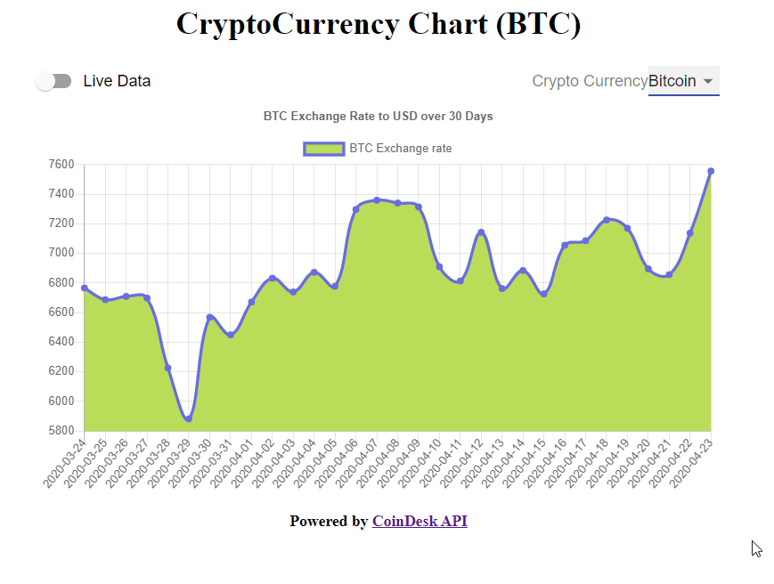

# Crpytocurrency Charting Tool

> SPA that displays historical price data on any cryptocurrency, with CoinDESK API for BTC data and CryptoCmpare for everything else.



## Table of Contents
1. [Requirements](#requirements)
1. [Getting Started](#getting_started)
1. [Usage](#usage)
1. [Tech Stack](#tech_stack)

## Requirements
1. Git
2. Node
3. CryptoCompare API key; Sign up for one [here](https://min-api.cryptocompare.com/)

## Getting Started
1. Clone repository on chall_2 branch `git clone https://github.com/Melvin-Viana/cryptoCurrency-Chart.git`

2. Install dependencies `npm install`

3. Build bundle file `npm run build`

4. Start server `npm run start`

## Usage
- Create an index.js file in the config folder. Add the following code to config/index.js:

```javascript
module.exports = {
  cryptoCompareKey: 'YOUR_API_KEY_HERE'
};
```
- The app is running on port 3000, open up the app on your favorite browser
- Data can be either live/cached data. App caches data that was saved in your current browser session.

## Tech Stack
- React
- Express
- [CoinDesk API](https://www.coindesk.com/API)
- [CryptoCompare API](https://min-api.cryptocompare.com/)
- [Webpack && Babel](https://www.valentinog.com/blog/babel/)
- [ChartJS](https://www.chartjs.org/)

## Known Issues
- Date is in UNIX format for anything that is not BTC
- Chart does not display data that is representative of how much greater BTC is than the other currencies at the time of development (4/23/2020)
